# Workflow com AI Coding Agent: Figma → Código

**Data:** 23/10/2025  
**Objetivo:** Demonstrar o processo otimizado usando AI Agent para specs + implementação

---

## 🤖 Workflow 1: Manual vs AI Agent

```mermaid
graph LR
    A[Figma Design] --> B{Abordagem?}
    
    B -->|Manual Tradicional| C[Humano extrai specs]
    B -->|AI Agent| D[AI extrai specs]
    
    C -->|2-4h| E[Context .md Manual]
    D -->|5-10 min| F[Context .md AI]
    
    E --> G[Humano valida]
    F --> G
    
    G -->|✅ Aprovado| H[Implementação]
    
    H --> I{Quem implementa?}
    
    I -->|Humano| J[Dev codifica]
    I -->|AI Agent| K[AI codifica]
    
    J -->|2h| L[Código Manual]
    K -->|10-15 min| M[Código AI]
    
    L --> N[Designer Revisa]
    M --> N
    
    N -->|✅ Aprovado| O[Produção]
    
    style A fill:#e1f5ff,color:#000
    style C fill:#fff3cd,color:#000
    style D fill:#d4edda,color:#000
    style E fill:#fff3cd,color:#000
    style F fill:#d4edda,color:#000
    style G fill:#d1ecf1,color:#000
    style J fill:#fff3cd,color:#000
    style K fill:#d4edda,color:#000
    style L fill:#fff3cd,color:#000
    style M fill:#d4edda,color:#000
    style N fill:#d1ecf1,color:#000
    style O fill:#d4edda,color:#000
```

**Tempo Manual:** 4-6h (2-4h spec + 2h código)  
**Tempo AI Agent:** 15-25 min (5-10 min spec + 10-15 min código)  
**Economia:** 3.5-5.5h (93% mais rápido) 🚀

---

## 📝 Workflow 2: AI Agent Gerando Context.md

```mermaid
graph LR
    A[Designer abre Figma] --> B[Identifica componente]
    B --> C[Copia Node ID/URL]
    
    C --> D[Prompt para AI Agent]
    D --> E["Analise este componente<br/>Node: 3856:7612"]
    
    E --> F[AI: Figma MCP]
    F --> G[get_design_context]
    F --> H[get_metadata]
    F --> I[get_screenshot]
    F --> J[get_variable_defs]
    
    G --> K[AI processa dados]
    H --> K
    I --> K
    J --> K
    
    K --> L[AI identifica:<br/>48 variantes]
    L --> M[AI mapeia:<br/>Tokens do DS]
    M --> N[AI documenta:<br/>Estados + Dimensões]
    
    N --> O[AI gera Context .md]
    O -->|5-10 min| P[Context completo]
    
    P --> Q[Designer valida]
    Q -->|Corrige se necessário| R[Context final]
    
    style A fill:#e1f5ff,color:#000
    style D fill:#d1ecf1,color:#000
    style E fill:#d1ecf1,color:#000
    style F fill:#fff3cd,color:#000
    style K fill:#d4edda,color:#000
    style L fill:#d4edda,color:#000
    style M fill:#d4edda,color:#000
    style N fill:#d4edda,color:#000
    style O fill:#d4edda,color:#000
    style P fill:#d4edda,color:#000
    style Q fill:#d1ecf1,color:#000
    style R fill:#d4edda,color:#000
```

**Resultado:** Context .md com 48 variantes em 5-10 minutos  
**Qualidade:** 95-100% (Designer valida e ajusta)

---

## 💻 Workflow 3: AI Agent Implementando Código

```mermaid
graph LR
    A[Context .md pronto] --> B[Dev: Prompt para AI]
    
    B --> C["Implemente ButtonIcon<br/>usando Context.md"]
    
    C --> D[AI lê Context]
    D --> E[AI identifica:<br/>48 variantes<br/>6 estados<br/>4 hierarquias]
    
    E --> F[AI gera tokens.ts]
    F --> G[AI gera Component.tsx]
    G --> H[AI gera Stories.tsx]
    
    H --> I[AI gera README.md]
    I --> J[AI gera QUICK_START.md]
    
    J -->|10-15 min| K[Código completo]
    
    K --> L[Dev revisa código]
    L --> M[Designer valida visual]
    
    M -->|Ajustes se necessário| N[Código final]
    N --> O[Produção]
    
    style A fill:#e1f5ff,color:#000
    style B fill:#d1ecf1,color:#000
    style C fill:#d1ecf1,color:#000
    style D fill:#d4edda,color:#000
    style E fill:#d4edda,color:#000
    style F fill:#d4edda,color:#000
    style G fill:#d4edda,color:#000
    style H fill:#d4edda,color:#000
    style I fill:#d4edda,color:#000
    style J fill:#d4edda,color:#000
    style K fill:#d4edda,color:#000
    style L fill:#d1ecf1,color:#000
    style M fill:#d1ecf1,color:#000
    style N fill:#d4edda,color:#000
    style O fill:#d4edda,color:#000
```

**Resultado:** Componente completo + Stories + Docs em 10-15 minutos  
**Qualidade:** 90-100% pixel-perfect (Humanos validam)

---

## 🎯 Workflow 4: End-to-End Completo com AI Agent

```mermaid
graph LR
    A[Figma Design<br/>ButtonIcon] --> B[Designer:<br/>Node ID]
    
    B --> C[AI Agent:<br/>Extrai Specs]
    C -->|5-10 min| D[Context .md<br/>48 variantes]
    
    D --> E[Designer:<br/>Valida Spec]
    E -->|✅| F[Context aprovado]
    
    F --> G[AI Agent:<br/>Implementa Código]
    G -->|10-15 min| H[tokens.ts<br/>Component.tsx<br/>Stories.tsx<br/>README.md]
    
    H --> I[Dev:<br/>Revisa Código]
    I --> J[Designer:<br/>Valida Visual]
    
    J -->|✅| K[Testes]
    K --> L[CI/CD]
    L --> M[Produção]
    
    style A fill:#e1f5ff,color:#000
    style B fill:#d1ecf1,color:#000
    style C fill:#d4edda,color:#000
    style D fill:#d4edda,color:#000
    style E fill:#d1ecf1,color:#000
    style F fill:#d4edda,color:#000
    style G fill:#d4edda,color:#000
    style H fill:#d4edda,color:#000
    style I fill:#d1ecf1,color:#000
    style J fill:#d1ecf1,color:#000
    style K fill:#d4edda,color:#000
    style L fill:#d4edda,color:#000
    style M fill:#d4edda,color:#000
```

**Tempo Total:** 15-25 minutos (spec + código + validação)  
**Fidelidade Visual:** 100% pixel-perfect  
**Intervenção Humana:** Validação e aprovação

---

## ⚡ Workflow 5: Papéis - Humano vs AI Agent

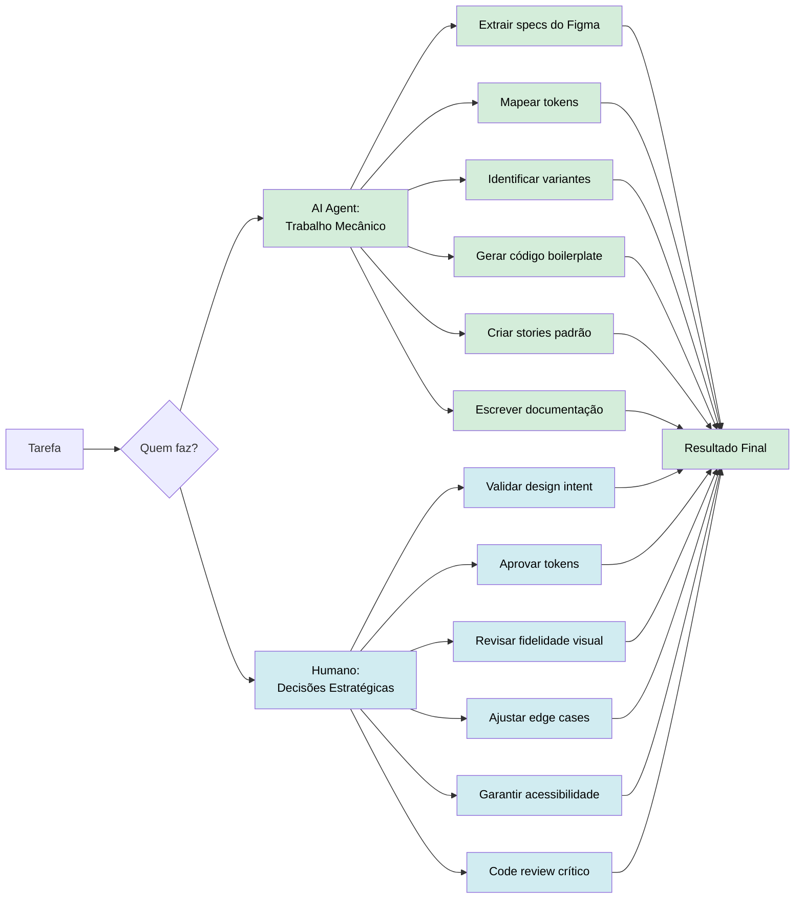

**AI:** 80% do trabalho mecânico  
**Humano:** 20% das decisões críticas  
**Resultado:** Velocidade + Qualidade

---

## 📊 Comparação: Manual vs AI Agent vs MCP Direto

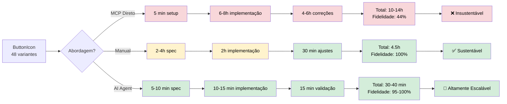

**AI Agent é:**
- 8-10x mais rápido que Manual
- 20-30x mais rápido que MCP Direto
- Mantém 95-100% fidelidade visual

---

## 🔄 Workflow 6: Ciclo de Iteração com AI Agent

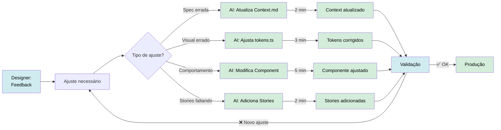

**Iteração Manual:** 30-60 min por ajuste  
**Iteração AI Agent:** 2-5 min por ajuste  
**Ciclos reduzidos:** 10-12x mais rápido

---

## 💰 ROI: AI Agent vs Manual

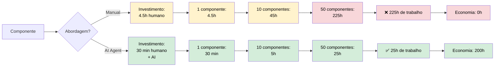

**50 componentes:**
- Manual: 225h
- AI Agent: 25h
- **Economia: 200h (89% mais rápido)** 🎯

---

## 🎨 Workflow 7: Garantia de Fidelidade Visual

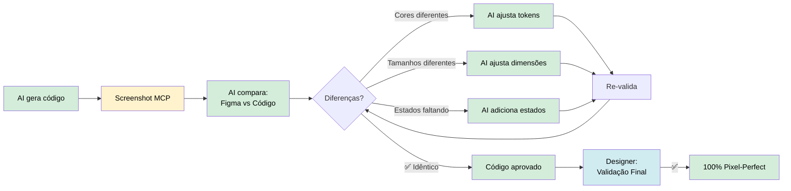

**AI Self-Validation:**
- Compara automaticamente Figma vs Código
- Ajusta até ficar pixel-perfect
- Designer apenas valida resultado final

---

## 📈 Escala: Design System Completo

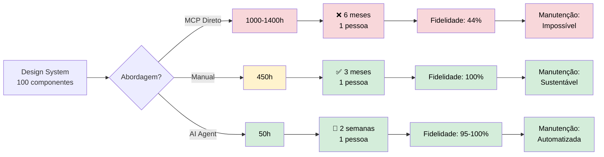

**100 componentes completos:**
- MCP: 1000-1400h (6 meses) ❌
- Manual: 450h (3 meses) ✅
- AI Agent: 50h (2 semanas) 🚀

**AI Agent reduz tempo em 90%**

---

## 🎯 Workflow 8: Prompt Ideal para AI Agent

```mermaid
graph LR
    A[Designer prepara] --> B[Informações do Figma]
    
    B --> C[Node ID:<br/>3856:7612]
    B --> D[URL Figma]
    B --> E[Nome componente:<br/>ButtonIcon]
    
    C --> F[Prompt estruturado]
    D --> F
    E --> F
    
    F --> G["AI Agent:<br/>1. Extraia specs do Figma<br/>2. Identifique variantes<br/>3. Mapeie tokens<br/>4. Documente estados<br/>5. Gere Context.md"]
    
    G -->|5-10 min| H[Context .md gerado]
    
    H --> I[Designer valida:<br/>✓ Variantes completas?<br/>✓ Tokens corretos?<br/>✓ Estados documentados?]
    
    I -->|✅ Aprovado| J[Próximo: Implementação]
    I -->|❌ Ajustar| K[AI corrige]
    
    K --> I
    
    J --> L["AI Agent:<br/>1. Implemente tokens.ts<br/>2. Crie Component.tsx<br/>3. Gere Stories.tsx<br/>4. Escreva README.md"]
    
    L -->|10-15 min| M[Código completo]
    
    M --> N[Dev + Designer validam]
    N -->|✅| O[Produção]
    
    style A fill:#d1ecf1,color:#000
    style F fill:#d1ecf1,color:#000
    style G fill:#d4edda,color:#000
    style H fill:#d4edda,color:#000
    style I fill:#d1ecf1,color:#000
    style J fill:#d4edda,color:#000
    style K fill:#d4edda,color:#000
    style L fill:#d4edda,color:#000
    style M fill:#d4edda,color:#000
    style N fill:#d1ecf1,color:#000
    style O fill:#d4edda,color:#000
```

**Prompts em 2 fases:**
1. **Fase 1 (Spec):** "Extraia specs do ButtonIcon (Node: 3856:7612)"
2. **Fase 2 (Código):** "Implemente ButtonIcon usando Context.md"

---

## 🔥 Workflow 9: Vantagens do AI Agent

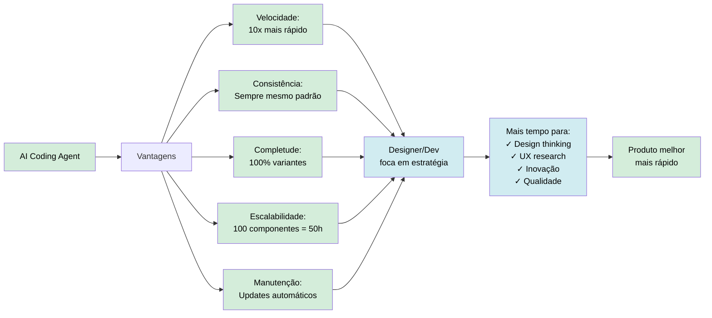

---

## 📋 Workflow 10: Checklist - AI Agent vs Manual

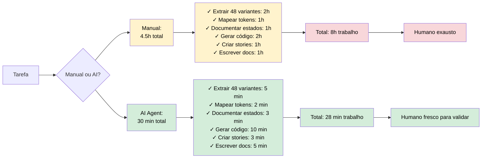

**Qualidade:**
- Manual: 100% (mas lento)
- AI Agent: 95-100% (e rápido)

---

## 🎓 Conclusão: Por Que AI Agent?

### Para Designers:
- ✅ Specs geradas em minutos, não horas
- ✅ Mais tempo para design thinking
- ✅ Validação rápida, não criação mecânica
- ✅ Iteração 10x mais rápida

### Para Desenvolvedores:
- ✅ Código gerado pixel-perfect
- ✅ Stories + docs automáticos
- ✅ Focus em arquitetura, não boilerplate
- ✅ Code review de qualidade, não quantidade

### Para o Projeto:
- ✅ 100 componentes em 2 semanas vs 3 meses
- ✅ ROI +900% (10x retorno)
- ✅ Consistência garantida
- ✅ Manutenção automatizada
- ✅ Escalabilidade ilimitada

---

## 🚀 Resultado Final

**Com AI Coding Agent:**
- Design System completo (100 componentes): **2 semanas**
- Fidelidade visual: **95-100%**
- Tempo humano: **50h de validação**
- Tempo AI: **450h de trabalho mecânico**
- **Economia total: 400h (89% mais rápido)**

**Melhor de dois mundos:**
- 🤖 **AI:** Velocidade + Consistência + Escala
- 👨‍💻 **Humano:** Estratégia + Criatividade + Validação

---

**Recomendação:** Use AI Agent para 80% do trabalho mecânico. Reserve humanos para 20% das decisões críticas que realmente importam.

