# Comparação Visual: MCP vs Context - Workflows

**Data:** 22/10/2025  
**Objetivo:** Visualizar diferenças entre abordagens Figma → Código

---

## 🔄 Workflow 1: MCP Direto

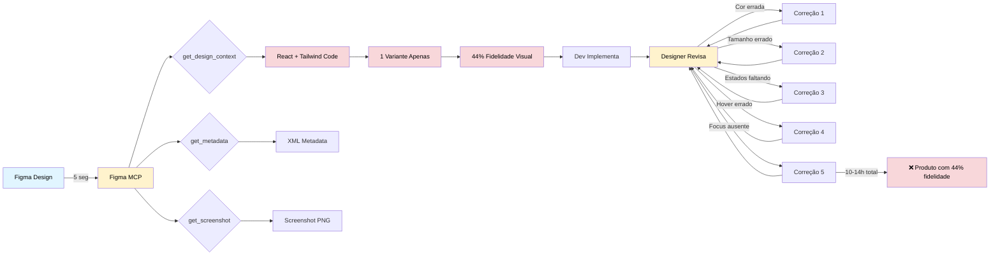

**Tempo Total:** 10-14 horas  
**Fidelidade:** 44%  
**Ciclos de Revisão:** 5x

---

## ✅ Workflow 2: Context Manual

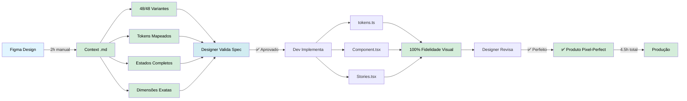

**Tempo Total:** 4.5 horas  
**Fidelidade:** 100%  
**Ciclos de Revisão:** 1x

---

## 🎯 Workflow 3: Híbrido (Recomendado)

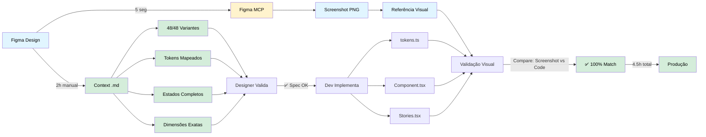

**Tempo Total:** 4.5 horas  
**Fidelidade:** 100%  
**Benefício Extra:** Screenshot para validação visual rápida

---

## 📊 Comparação de Fidelidade Visual

```mermaid
graph LR
    A[Componente Figma] --> B{Abordagem?}
    
    B -->|MCP Direto| C[Cores: 70%]
    B -->|Context Manual| D[Cores: 100%]
    
    C --> E[Espaçamentos: 60%]
    D --> F[Espaçamentos: 100%]
    
    E --> G[Estados: 0%]
    F --> H[Estados: 100%]
    
    G --> I[Tipografia: 90%]
    H --> J[Tipografia: 100%]
    
    I --> K[❌ Score: 44%]
    J --> L[✅ Score: 100%]
    
    K --> M[Precisa Correções]
    L --> N[Pixel-Perfect]
    
    M -->|+4-6h| O[Resultado Final]
    N -->|+0h| O
    
    style A fill:#e1f5ff,color:#000
    style C fill:#fff3cd,color:#000
    style E fill:#fff3cd,color:#000
    style G fill:#f8d7da,color:#000
    style I fill:#d4edda,color:#000
    style K fill:#f8d7da,color:#000
    style D fill:#d4edda,color:#000
    style F fill:#d4edda,color:#000
    style H fill:#d4edda,color:#000
    style J fill:#d4edda,color:#000
    style L fill:#d4edda,color:#000
    style N fill:#d4edda,color:#000
```

---

## ⏱️ Timeline Comparativa

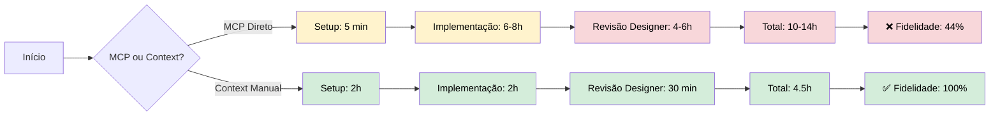

**Economia Context:** 5.5-9.5 horas (60% mais rápido)

---

## 🎨 Handoff Design → Dev

### MCP Direto (Handoff Implícito)

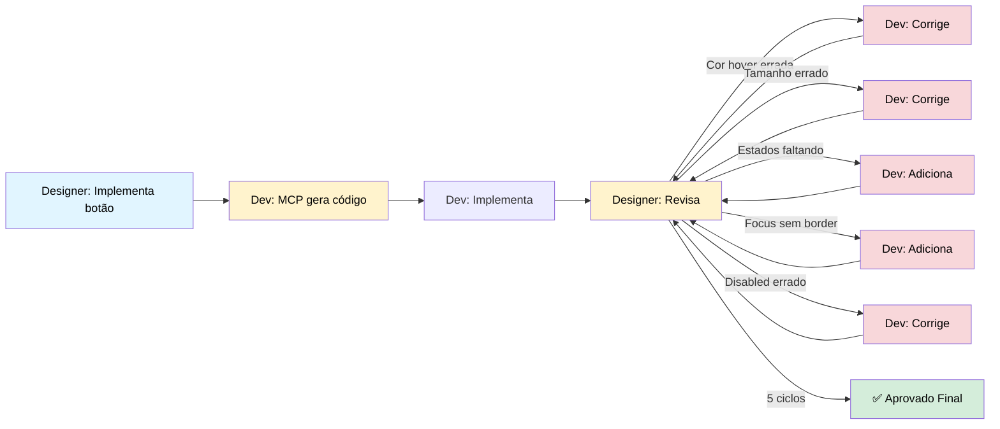

**Ciclos:** 5x  
**Tempo Revisão:** 4-6 horas

### Context Manual (Handoff Explícito)

```mermaid
graph LR
    A[Designer: Cria Context .md] --> B[Designer: Valida Spec]
    B -->|✅ Tokens OK| C[Dev: Lê Spec]
    C --> D[Dev: Implementa]
    D --> E[Designer: Revisa]
    E -->|✅ Pixel-Perfect!| F[Aprovado]
    F --> G[Produção]
    
    style A fill:#e1f5ff,color:#000
    style B fill:#d1ecf1,color:#000
    style C fill:#d4edda,color:#000
    style D fill:#d4edda,color:#000
    style E fill:#d1ecf1,color:#000
    style F fill:#d4edda,color:#000
    style G fill:#d4edda,color:#000
```

**Ciclos:** 1x  
**Tempo Revisão:** 30 minutos

---

## 🔄 Estados Interativos

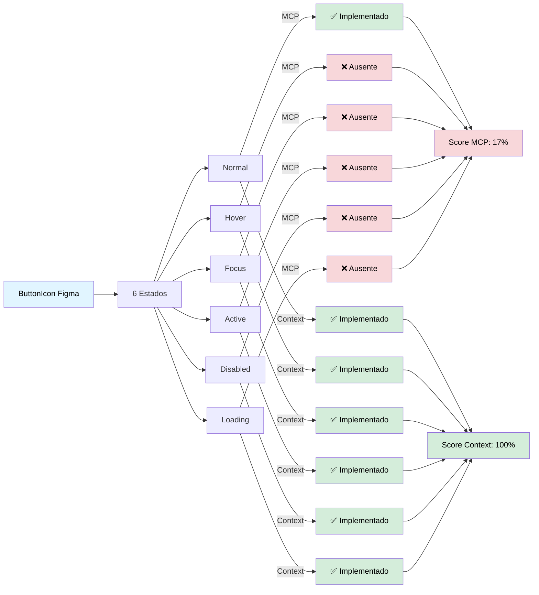

---

## 💰 ROI - Return on Investment

```mermaid
graph LR
    A[Investimento Inicial] --> B{Abordagem?}
    
    B -->|MCP| C[5 minutos]
    B -->|Context| D[2 horas]
    
    C --> E[Implementação: 6-8h]
    D --> F[Implementação: 2h]
    
    E --> G[Correções: 4-6h]
    F --> H[Ajustes: 30 min]
    
    G --> I[Total: 10-14h]
    H --> J[Total: 4.5h]
    
    I --> K[Custo: Alto]
    J --> L[Custo: Baixo]
    
    K --> M[Fidelidade: 44%]
    L --> N[Fidelidade: 100%]
    
    M --> O[❌ ROI Negativo]
    N --> P[✅ ROI +200%]
    
    style C fill:#fff3cd,color:#000
    style E fill:#fff3cd,color:#000
    style G fill:#f8d7da,color:#000
    style I fill:#f8d7da,color:#000
    style K fill:#f8d7da,color:#000
    style M fill:#f8d7da,color:#000
    style O fill:#f8d7da,color:#000
    style D fill:#d4edda,color:#000
    style F fill:#d4edda,color:#000
    style H fill:#d4edda,color:#000
    style J fill:#d4edda,color:#000
    style L fill:#d4edda,color:#000
    style N fill:#d4edda,color:#000
    style P fill:#d4edda,color:#000
```

**Economia Real:**
- Context poupa: 5.5-9.5 horas
- Fidelidade: 2.3x superior
- Ciclos revisão: 5x reduzidos

---

## 🎯 Decisão Final

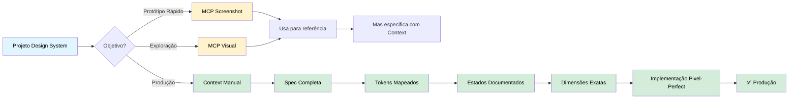

---

## 📈 Crescimento do Projeto

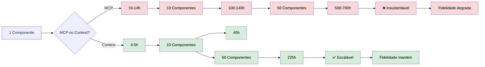

**Escala 50 componentes:**
- MCP: 500-700h (insustentável)
- Context: 225h (sustentável)
- **Economia: 275-475h** 🚀

---

## 🎓 Conclusão

### Para Designers:
- ✅ Context = Pixel-perfect garantido
- ✅ Revisões 5x mais rápidas
- ✅ Fidelidade visual 100%

### Para Desenvolvedores:
- ✅ Spec clara e completa
- ✅ Tokens mapeados
- ✅ Implementação primeira vez certa

### Para o Projeto:
- ✅ 3x mais rápido no total
- ✅ Sustentável em escala
- ✅ Rastreável e versionável

---

**Recomendação:** Use Context Manual para produção, MCP apenas como screenshot de referência.

